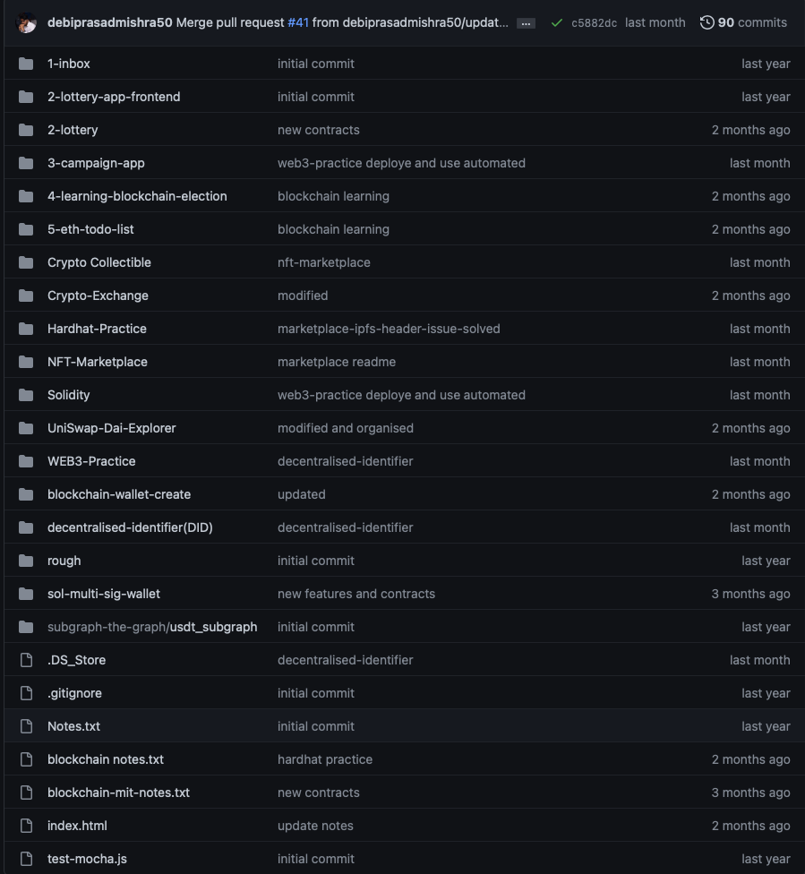
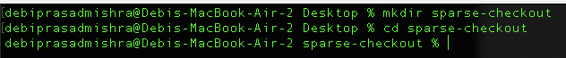
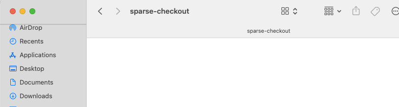
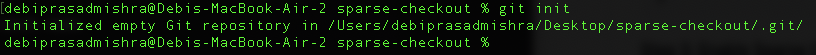
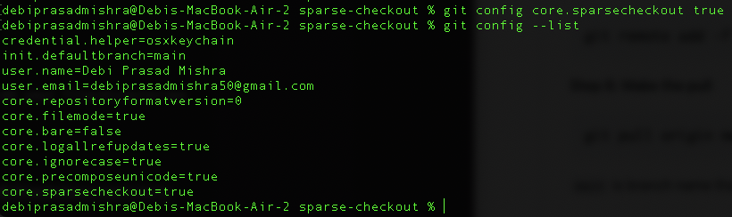
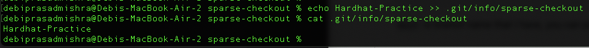
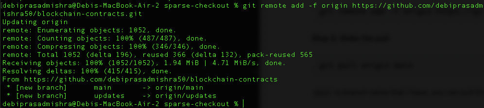
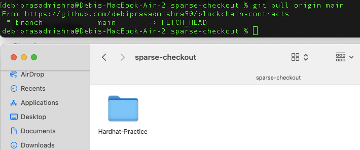

# Spare Checkout

This is useful when there is a repo consists of multiple packages and you require only a part of the codebase to work.

## Example

In the repo [blockchain-contracts](https://github.com/debiprasadmishra50/blockchain-contracts) assuming you require Hardhat-setup which is present in `Hardhat-Practice` folder. However, to retrieve the folder you need to pull whole repo and remove the unrequired files/folder and sometimes in protocols it is much more complicated.



In that scenario you can follow `sparse-checkout` feauture of git to fetch only that folder.

## Sparse Checkout in action

This is exactly what [sparse checkouts](https://schacon.github.io/git/git-read-tree.html) enable.

### Steps to follow

**Step 1: Create a directory**

```console
mkdir sparse-checkout
cd sparse-checkout
```

**Step 2: Initialise a git repository**

```console
git init
```

**Step 3: Enable Sparse Checkout**

```console
git config core.sparsecheckout true
```

**Step 4: Add the directories/files you require**

```console
echo Hardhat-Practice >> .git/info/sparse-checkout
```

_`Hardhat-Practice`_ is folder name that I require, you can add your file/directories

**Step 5: Add and fetch remote**

```console
git remote add -f origin https://github.com/debiprasadmishra50/blockchain-contracts
```

**Step 6: Make the pull**

```console
git pull origin main
```

_`main`_ is branch name that I have, you can pull from any branch name

### Steps in action

**Step 1**





**Step 2**



**Step 3**



**Step 4**



**Step 5**



**Step 6**



## Author

- [Debi Prasad Mishra](https://debiprasadmishra.net)
